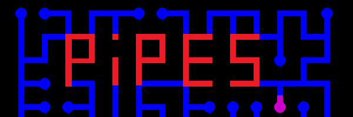

# Pipes

Pipe logic based puzzle game.

## How to play

The point of the game is to align all the pipes so that water will flow through every pipe. Each pipe can be rotated 90 degrees to connect to adjacent pipes. When the puzzle is completete each pipe connection will be joined to another, and there will be no loops.

You can move around the grid with h,j,k,l, and rotate pipes with the spacebar.

## Features

* Create pipe puzzles from 3x3 to 29x29 +
* Save and load pipe puzzles.
* Generate puzzles.
* Randomize puzzles.
* Solve puzzles.
